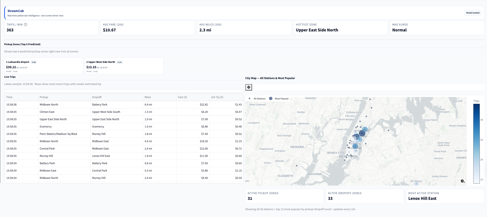
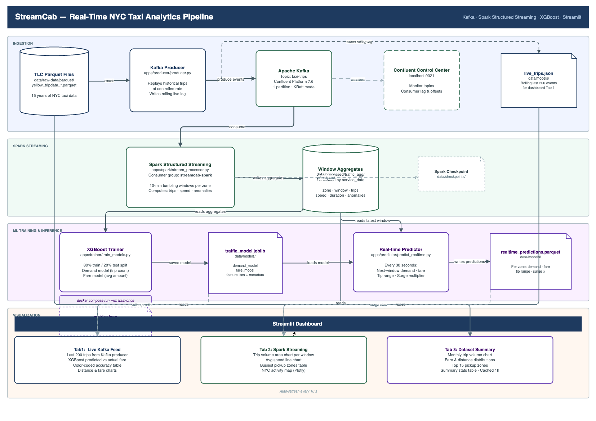

# StreamCab

**From Parquet to Real-Time Predictions**.  
From raw historical parquet data to a live Kafka + Spark pipeline with XGBoost fare and tip predictions, powered by an interactive dashboard.

## Overview



## Build with

- Python for data processing and application logic
- Apache Kafka for real-time event streaming
- PySpark and Spark Structured Streaming for stream processing
- XGBoost for tip prediction
- Streamlit for interactive visualization
- Docker Compose for local **orchestration**

## Architecture



---

## Quick Start

.env file is not copied committed to Github for security reason. Create you own .env file. See .env.example for reference.

### Step 1 — Download TLC data

---

This end point have rate limiting so try to keep start and end date small

```bash
python scripts/download_tlc_data.py --output data/raw-data/parquet --start 2022-01 --end 2024-12
```

### Step 2 — Train the model.

Please update the env file with location of your training data.

```bash
docker compose run --rm train-once
```

Once your training is completed, you should see:

| File                          | Contents                            |
| ----------------------------- | ----------------------------------- |
| `models/traffic_model.joblib` | Trained XGBoost predictor           |
| `models/metrics.json`         | Train & test MAE / MAPE vs baseline |

### Step 3 — Start the live pipeline

This is spin multiplied docker containers.

```bash
docker compose up --build
```

Then open **[http://localhost:8501](http://localhost:8501)** for the dashboard.

---

## Suggested Data Locations.

| Path                                       | Contents                                  |
| ------------------------------------------ | ----------------------------------------- |
| `data/raw-data/parquet/`                   | Raw yellow taxi parquet files             |
| `data/models/traffic_model.joblib`         | Trained XGBoost model                     |
| `data/models/metrics.json`                 | Training metrics                          |
| `data/models/live_trips.json`              | Rolling log of last 200 Kafka trips       |
| `data/models/realtime_predictions.parquet` | Per-zone predictions (updated every 30 s) |
| `data/reference/zone_centroids.csv`        | NYC TLC zone names and map coordinates    |

---

## Useful Commands

```bash
# One-time model training
docker compose run --rm train-once

# Start full pipeline
docker compose up --build

# Stop everything
docker compose down

# Convert parquet files to CSV (optional)
python scripts/convert-to-csv.py --input data/raw-data/parquet --output data/raw-data/csv
```

## Services

| Service           | Description                                                           |
| ----------------- | --------------------------------------------------------------------- |
| `kafka`           | Confluent Kafka in KRaft mode                                         |
| `init-kafka`      | Creates the `taxi-trips` topic on first startup                       |
| `control-center`  | Confluent Control Center UI — [localhost:9021](http://localhost:9021) |
| `producer`        | Replays TLC parquet → Kafka at ~7 trips/second                        |
| `spark-streaming` | Spark Structured Streaming → 10-min window aggregates                 |
| `predictor`       | Runs XGBoost fare model every 30 s → predictions file                 |
| `dashboard`       | Streamlit dashboard — [localhost:8501](http://localhost:8501)         |
| `train-once`      | One-shot trainer (run separately with `docker compose run`)           |
